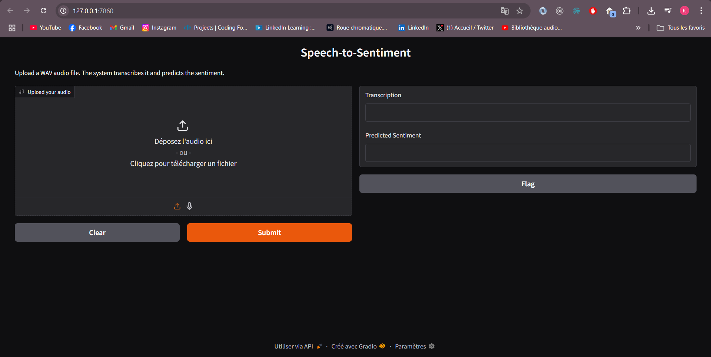
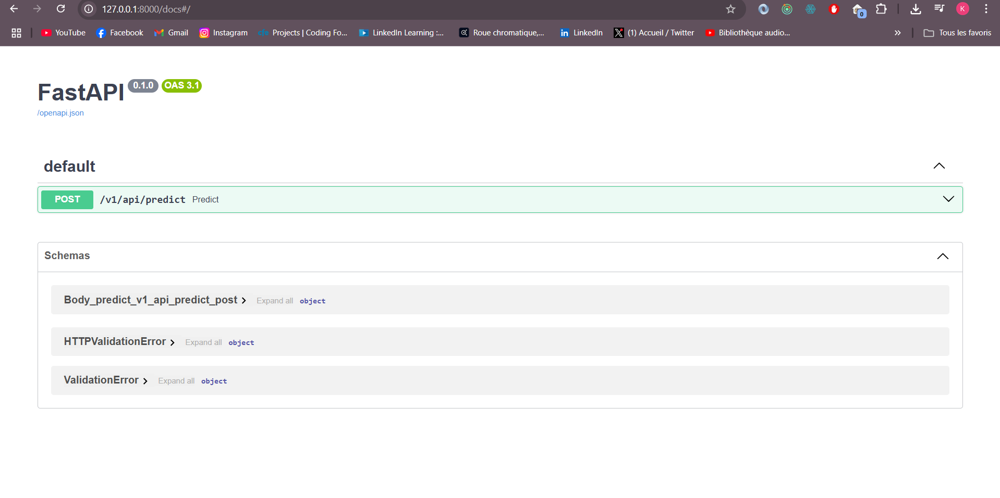

#  Speech-to-Sentiment
Pipeline complet pour analyser un fichier audio en langue anglaise, le transcrire en texte et en prédire le sentiment associé.

##  Architecture du projet
```graphql
Speech-to-Sentiment/
├── data/                      # Données audio (Savee, Ravdess, Crema, Tess) (non versionné)
├── pipeline.py                # Pipeline principal : transcription + sentiment
├── gradio_ui.py               # Interface Gradio pour tester le pipeline
├── api.py                     # API FastAPI pour intégration dans d'autres apps
├── extract_labels.py          # Génération du CSV avec labels émotion/sentiment   
├── all_labels.csv             # Fichier CSV généré avec chemins et labels
├── evaluation_results.csv     # Résultats d’évaluation du pipeline
├── requirements.txt           # Dépendances du projet
├── README.md                  # Documentation
├── venv/                      # Environnement virtuel Python (non versionné)
```

## Étapes de reproduction
-  Prérequis
  Python >= 3.8, Git et Accès internet pour télécharger les modèles HuggingFace

- Installation
1 Clonez le dépôt :
```bash
git clone <lien_du_depot>
cd Speech-to-Sentiment
```
2️ Créez un environnement virtuel :
```bash
python -m venv venv
.\venv\Scripts\activate   # sous Windows
# ou
source venv/bin/activate  # sous Linux/Mac
```
3️ Installez les dépendances :
```bash
pip install -r requirements.txt
```

4 Puis exécutez :
```bash
python extract_labels.py
```
Cela génère le fichier all_labels.csv.

5 Évaluer le pipeline
Lancez l’évaluation complète du dataset : 
```bash
python pipeline.py
```
Les résultats (transcriptions, sentiments prévus et vrais) sont sauvegardés dans evaluation_results.csv.

- Lancer l’interface Gradio

```bash
python gradio_ui.py
```
- Une URL locale et une URL publique seront affichées.
- Vous pouvez téléverser un fichier .wav et voir la transcription et le sentiment.

- Lancer l’API FastAPI

```bash
python api.py
```
- Documentation interactive de l’API accessible sur :
http://localhost:8000/docs


## Cas d’usage
- Évaluer un corpus d’audio annotés pour tester la robustesse du pipeline.
- Intégrer la prédiction de sentiment d’audio dans une application tierce via l’API FastAPI.
- Permettre à des utilisateurs de tester le pipeline facilement via l’interface Gradio.
- Visualiser les résultats d’évaluation pour analyser les erreurs et améliorer la précision